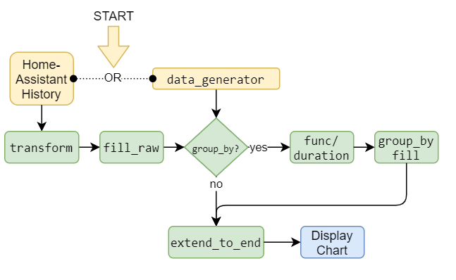
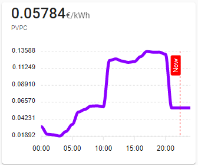
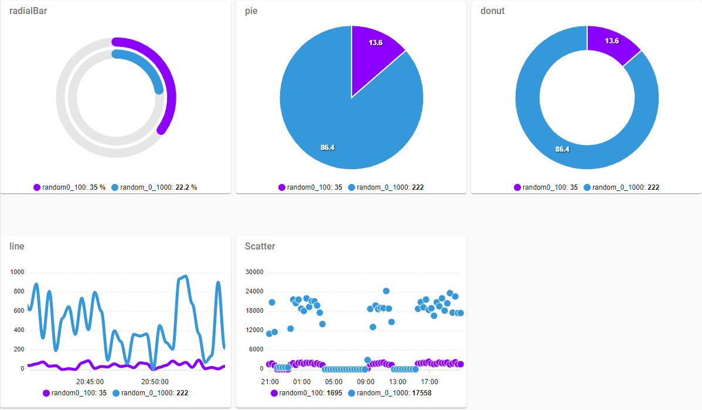
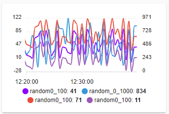
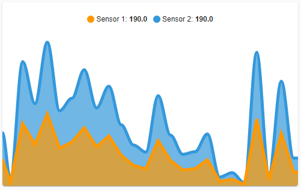
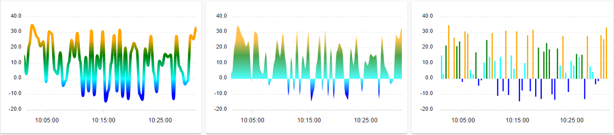
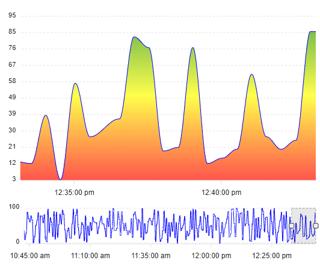
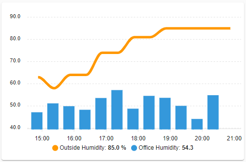
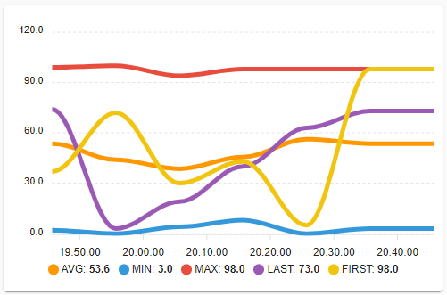

[](LICENSE)
[](https://github.com/custom-components/hacs)


[](https://github.com/RomRider/apexcharts-card/releases/latest)
[](https://github.com/RomRider/apexcharts-card/releases)
[](https://community.home-assistant.io/t/apexcharts-card-a-highly-customizable-graph-card/272877)

# ApexCharts Card by [@RomRider](https://github.com/RomRider) <!-- omit in toc -->


This is higly customizable graph card for [Home-Assistant](https://www.home-assistant.io)'s Lovelace UI.<br/>

It is based on [ApexCharts.js](https://apexcharts.com) and offers most of the features of the library.

It is also inspired by the great [`mini-graph-card`](https://github.com/kalkih/mini-graph-card) by [@kalkih](https://github.com/kalkih)


However, some things might be broken :grin:

## Table of Content <!-- omit in toc -->

- [Installation](#installation)
  - [HACS (recommended)](#hacs-recommended)
  - [Manual install](#manual-install)
  - [CLI install](#cli-install)
  - [Add resource reference](#add-resource-reference)
- [Data processing steps](#data-processing-steps)
- [Using the card](#using-the-card)
  - [Main Options](#main-options)
  - [`series` Options](#series-options)
  - [series' `show` Options](#series-show-options)
  - [`header_actions` or `title_actions` options](#header_actions-or-title_actions-options)
  - [`*_action` options](#_action-options)
  - [`confirmation` options](#confirmation-options)
  - [`statistics` options](#statistics-options)
  - [Main `show` Options](#main-show-options)
  - [`header` Options](#header-options)
  - [`now` Options](#now-options)
  - [`group_by` Options](#group_by-options)
  - [`func` Options](#func-options)
  - [`chart_type` Options](#chart_type-options)
  - [`span` Options](#span-options)
  - [`transform` Option](#transform-option)
  - [`data_generator` Option](#data_generator-option)
  - [`yaxis` Options. Multi-Y axis](#yaxis-options-multi-y-axis)
    - [Min/Max Format](#minmax-format)
    - [Examples](#examples)
  - [Apex Charts Options Example](#apex-charts-options-example)
  - [Layouts](#layouts)
  - [Configuration Templates](#configuration-templates)
    - [General](#general)
    - [`all_series_config` options](#all_series_config-options)
- [Experimental features](#experimental-features)
  - [Configuration options](#configuration-options)
  - [`color_threshold` experimental feature](#color_threshold-experimental-feature)
  - [`hidden_by_default` experimental feature](#hidden_by_default-experimental-feature)
  - [`brush` experimental feature](#brush-experimental-feature)
- [Known issues](#known-issues)
- [Roadmap](#roadmap)
- [Examples](#examples-1)
  - [Simple graph](#simple-graph)
  - [Multiple Types of Graphs](#multiple-types-of-graphs)
  - [Aggregating data](#aggregating-data)
  - [Compare data from today with yesterday](#compare-data-from-today-with-yesterday)
  - [Change the line thickness](#change-the-line-thickness)
  - [Use apexcharts-card with auto-entities](#use-apexcharts-card-with-auto-entities)
  - [Change the height of the graph](#change-the-height-of-the-graph)

## Installation

### HACS (recommended)

This card is available in [HACS](https://hacs.xyz/) (Home Assistant Community Store).
<small>_HACS is a third party community store and is not included in Home Assistant out of the box._</small>

### Manual install

1. Download and copy `apexcharts-card.js` from the [latest release](https://github.com/RomRider/apexcharts-card/releases/latest) into your `config/www` directory.

2. Add the resource reference as decribed below.

### CLI install

1. Move into your `config/www` directory.

2. Grab `apexcharts-card.js`:

```
$ wget https://github.com/RomRider/apexcharts-card/releases/download/v2.0.2/apexcharts-card.js
```

3. Add the resource reference as decribed below.

### Add resource reference

If you configure Lovelace via YAML, add a reference to `apexcharts-card.js` inside your `configuration.yaml`:

```yaml
resources:
  - url: /local/apexcharts-card.js?v=2.0.2
    type: module
```

Else, if you prefer the graphical editor, use the menu to add the resource:

1. Make sure, advanced mode is enabled in your user profile (click on your user name to get there)
2. Navigate to Configuration -> Lovelace Dashboards -> Resources Tab. Hit orange (+) icon
3. Enter URL `/local/apexcharts-card.js` and select type "JavaScript Module".
4. Restart Home Assistant.

## Data processing steps

This diagrams shows how your data goes through all the steps allowed by this card:



## Using the card

### Main Options

:warning: Since this card is in its debuts, you should expect breaking changes moving forward. :warning:

The card stricly validates all the options available (but not for the `apex_config` object). If there is an error in your configuration, it will tell you where and display a red error card.


:white_check_mark: **means required**.

| Name | Type | Default | Since | Description |
| ---- | :--: | :-----: | :---: | ----------- |
| :white_check_mark: `type` | string | | v1.0.0 | `custom:apexcharts-card` |
| :white_check_mark: `series` | array | | v1.0.0 | See [series](#series-options) |
| `config_templates` | array | | v1.6.0 | Define a configuration once and reuse it multiple times. See [config_templates](#configuration-templates) |
| `color_list` | array | | v1.6.0 | Define the array of colors applied to the series. Will be overriden by each serie's color if defined. Usefull for `config_templates` mainly. |
| `all_series_config` | object | | v1.6.0 | If something is defined here it will apply this config to all the series. It accepts the same options as a serie minus `entity`. It is useful to avoid repetition but the same thing can be achieve in each serie individually. See [series](#series-options) and [all_series_config](#all_series_config-options) for an example |
| `chart_type` | string | `line` | v1.4.0 | See [chart_type](#chart_type-options) |
| `update_interval` | string | | v1.1.0 | By default the card updates on every state change. Setting this overrides the behaviour. Valid values are any time string, eg: `1h`, `12min`, `1d`, `1h25`, `10sec`, ... |
| `update_delay` | string | `1500ms` | v1.4.0 | If the chart doesn't display the last state but the one before, you'll want to increase this value, don't go over `10s`, it's not necessary. You'll also want to increase this value if you are using `attribute` in the `series`. Valid values are any time strings. This is because of how Home-Assistant works with history, see [here](https://www.home-assistant.io/integrations/recorder/#commit_interval) |
| `graph_span` | string | `24h` | v1.1.0 | The span of the graph as a time interval. Valid values are any time string, eg: `1h`, `12min`, `1d`, `1h25`, `10sec`, ... |
| `span` | object | | v1.2.0 | See [span](#span-options) |
| `show` | object | | v1.0.0 | See [show](#main-show-options) |
| `hours_12` | boolean | | v1.8.0 | If undefined, it will follow Home-Assistant's user time format. If `true`, it will force time to be displayed in 12h format. If `false` it will force the time to be displayed in 24h format. |
| `cache` | boolean | `true` | v1.0.0 | Use in-browser data caching to reduce the load on Home Assistant's server |
| `stacked` | boolean | `false` | v1.0.0 | Enable if you want the data to be stacked on the graph |
| `layout` | string | | v1.0.0 | See [layouts](#layouts) |
| `header` | object | | v1.0.0 | See [header](#header-options) |
| `now` | object | | v1.5.0 | See [now](#now-options) |
| ~~`y_axis_precision`~~ | ~~number~~ | ~~`1`~~ | ~~v1.2.0~~ | **DEPRECATED since v1.10.0** ~~The float precision used to display numbers on the Y axis. Only works if `yaxis` is undefined.~~ |
| `yaxis` | array | | v1.9.0 | See [yaxis](#yaxis-options-multi-y-axis) |
| `apex_config`| object | | v1.0.0 | Apexcharts API 1:1 mapping. You call see all the options [here](https://apexcharts.com/docs/installation/) --> `Options (Reference)` in the Menu. See [Apex Charts](#apex-charts-options-example) |
| `experimental` | object | | v1.6.0 | See [experimental](#experimental-features) |
| `locale` | string | | v1.7.0 | Default is to inherit from Home-Assistant's user configuration. This overrides it and forces the locale. Eg: `en`, or `fr`. Reverts to `en` if locale is unknown. |
| `brush` | object | | v1.8.0 | See [brush](#brush-experimental-feature) |


### `series` Options

| Name | Type | Default | Since | Description |
| ---- | :--: | :-----: | :---: | ----------- |
| :white_check_mark: `entity` | string | | v1.0.0 | The `entity_id` of the sensor to display |
| `attribute` | string | | v1.4.0 | Instead of retrieving the state, it will retrieve an `attribute` of the entity. Make sure you increase `update_delay` if the chart doesn't reflect the last value of the attribute |
| `name` | string | | v1.0.0 | Override the name of the entity |
| `color` | string | | v1.1.0 | Color of the serie. Supported formats: `yellow`, `#aabbcc`, `rgb(128, 128, 128)` or `var(--css-color-variable)` |
| `opacity` | number | `0.7` for `area`<br/>else `1` | v1.6.0 | The opacity of the line or filled area, between `0` and `1` |
| `stroke_width` | number | `5` | v1.6.0 | Change the width of the line. Only works for `area` and `line` |
| `type` | string | `line` | v1.0.0 | `line`, `area` or `column` are supported for now |
| `curve` | string | `smooth` | v1.0.0 | `smooth` (nice curve),  `straight` (direct line between points) or `stepline` (flat line until next point then straight up or down) |
| ~~`extend_to_end`~~ | ~~boolean~~ | ~~`true`~~ | ~~v1.0.0~~ | **DEPRECATED since v2.0.0** ~~If the last data is older than the end time displayed on the graph, setting to true will extend the value until the end of the timeline. Only works for `line` and `area` types.~~ |
| `extend_to` | boolean or string | `end` | v2.0.0 | If value is `end`, it will extend the line/area to the end of the chart. With `now`, it will extend it to the current time (usefull for chart showing current and future data). If `false` it will not do anything. Only available for `line` and `area` types. |
| `unit` | string | | v1.0.0 | Override the unit of the sensor |
| `float_precision` | number | `1` | v1.2.0 | The precision used to display data in the legend and the tooltip. It doesn't impact how the data is displayed on the graph |
| `fill_raw` | string | `'null'` | v1.5.0 | If there is any missing value in the history, `last` will replace them with the last non-empty state, `zero` will fill missing values with `0`, `'null'` will fill missing values with `null`. This is applied before `group_by` options |
| `group_by` | object | | v1.0.0 | See [group_by](#group_by-options) |
| `invert` | boolean | `false` | v1.2.0 | Negates the data (`1` -> `-1`). Usefull to display opposites values like network in (standard)/out (inverted) |
| `transform` | string | | v1.5.0 | Transform your raw data in any way you like. See [transform](#transform-option) |
| `data_generator` | string | | v1.2.0 | See [data_generator](#data_generator-option) |
| `statistics` | object | | v2.0.0 | Use HA statistical data (long-term). See [statistics](#statistics-options) |
| `offset` | string | | v1.3.0 | This is different from the main `offset` parameter. This is at the series level. It is only usefull if you want to display data from for eg. yesterday on top of the data from today for the same sensor and compare the data. The time displayed in the tooltip will be wrong as will the x axis information. Valid values are any negative time string, eg: `-1h`, `-12min`, `-1d`, `-1h25`, `-10sec`, ... `month` (365.25 days / 12) and `year` (365.25 days) as unit will generate inconsistent result, you should use days instead. |
| `time_delta` | string | | v2.0.0 | This applies a time delta to all the datapoints of your chart **after** fetching them. You can cumulate it with `offset`. Valid values are any time strings starting with `+` or `-`, eg: `-30min`, `+2h`, `-2d`, ... |
| `min` | number | `0` | v1.4.0 | Only used when `chart_type = radialBar`, see [chart_type](#chart_type-options). Used to convert the value into a percentage. Minimum value of the sensor |
| `max` | number | `100` | v1.4.0 | Only used when `chart_type = radialBar`, see [chart_type](#chart_type-options). Used to convert the value into a percentage. Maximum value of the sensor |
| `color_threshold` | object | | v1.6.0 | See [experimental](#experimental-features) |
| `yaxis_id` | string | | v1.9.0 | The identification name of the y-axis which this serie should be associated to. See [yaxis](#yaxis-options-multi-y-axis) |
| `show` | object | | v1.3.0 | See [serie's show options](#series-show-options) |
| `header_actions` | object | | v1.10.0 | See [header_actions](#header_actions-or-title_actions-options) |

### series' `show` Options

| Name | Type | Default | Since | Description |
| ---- | :--: | :-----: | :---: | ----------- |
| `legend_value` | boolean | `true` | v1.3.0 | Show/Hide the state in the legend. Will still display the name |
| `as_duration` | string | | v1.3.0 | Will pretty print the states as durations. Doesn't affect the graph, only the tooltip/legend/header display. You provide the source unit of your sensor. Valid values are `millisecond`, `second`, `minute`, `hour`, `day`, `week`, `month`, `year`.<br/>Eg: if the state is `345` and `as_duration` is set to `minute` then it would display `5h 45m` |
| `in_header` | boolean or string | `true` | v1.4.0 | If `show_states` is enabled, this would show/hide this specific serie in the header. If set to `raw` (introduced in v1.7.0), it would display the latest raw state of the entity in the header bypassing any grouping/transformation done by the card. If the graph spans into the future (using `data_generator`): `before_now` would display the value just before the current time and `after_now` would display the value just after the current time (Introduced in v1.8.0) |
| `name_in_header` | boolean | `true` | v1.8.0 | Only valid if `in_header: true`. If `false`, it will hide the name of the serie under the its state in the header |
| `header_color_threshold` | boolean | `false` | v1.7.0 | If `true` and `color_threshold` experimental mode is enabled, it will colorize the header's state based on the threshold (ignoring opacity). |
| `in_chart` | boolean | `true` | v1.4.0 | If `false`, hides the serie from the chart |
| `datalabels` | boolean or string | `false` | v1.5.0 | If `true` will show the value of each point for this serie directly in the chart. Don't use it if you have a lot of points displayed, it will be a mess. If you set it to `total` (introduced in v1.7.0), it will display the stacked total value (only works when `stacked: true`). If you set it to `percent`, it will display the percentage of the serie instead of the value in the case of a `pie` or `donut` chart. |
| `hidden_by_default` | boolean | `false` | v1.6.0 | See [experimental](#hidden_by_default-experimental-feature) |
| `extremas` | boolean or string | `false` | v1.7.0 | If `true`, will show the min and the max of the serie in the chart.  If the value is `time`, it will display also the time of the min/max value on top of the value. From v2.0.0, `min` or `max` will display the min or the max only and `min+time` or `max+time` will display the time of the min or the max. Displaying the time doesn't work with `stacked: true`. |
| `in_brush` | boolean | `false` | v1.8.0 | See [brush](#brush-experimental-feature) |
| `offset_in_name` | boolean | `true` | v1.8.0 | If `true`, appends the offset information to the name of the serie. If `false`, it doesn't |

### `header_actions` or `title_actions` options


| Name | Type | Default | Since | Description |
| ---- | :--: | :-----: | :---: | ----------- |
| `tap_action` | object | | v1.10.0 | Action to perform on tap. See [action options](#_action-options) |
| `hold_action` | object | | v1.10.0 | Action to perform on hold. See [action options](#_action-options) |
| `double_tap_action` | object | | v1.10.0 | Action to perform on double tap. See [action options](#_action-options) |

### `*_action` options

| Name | Type | Default | Since | Description |
| ---- | :--: | :-----: | :---: | ----------- |
| `action` | string | `more-info` | v1.10.0 | Action to perform. Valid values are: `more-info`, `toggle`, `call-service`, `none`, `navigate`, `url` |
| `entity` | string | | v1.10.0 | Only valid for `more-info`. Overrides the `more-info` target entity. Default is to use the serie's entity |
| `navigation_path` | string | | v1.10.0 | Path to navigate to (e.g. `/lovelace/0/`) when action is `navigate` |
| `url_path` | string | | v1.10.0 | URL to open on click when action is `url`. The URL will open in a new tab |
| `service` | string | | v1.10.0 | Any valid Home-Assistant service |
| `service_data` | object | | v1.10.0 | Service data to include (e.g. `entity_id: media_player.bedroom`) when `action` defined as `call-service` |
| `confirmation` | object | | v1.10.0 |Display a confirmation popup. See [confirmation](#confirmation-options) |

Example:
```yaml
type: custom:apexcharts-card
series:
  - entity: sensor.indoor_temperature
    header_actions:
      tap_action:
        action: call-service
        service: climate.turn_on
        service_data:
          entity_id: climate.heater
```

### `confirmation` options

This will popup a dialog box before running the action.

| Name | Type | Default | Since | Description |
| ---- | :--: | :-----: | :---: | ----------- |
| `text` | string | | v1.10.0 | This text will be displayed in the popup |
| `exemptions` | array | | v1.10.0 | Any user declared in this list will not see the confirmation dialog. Format `user: USER_ID` |

Example:

```yaml
type: custom:apexcharts-card
series:
  - entity: sensor.indoor_temperature
    header_actions:
      tap_action:
        action: call-service
        service: script.toggle_climate
        service_data:
          entity: climate.heater
        confirmation:
          text: Are you sure?
          exemptions:
            - user: befc8496799848bda1824f2a8111e30a
```

### `statistics` options

| Name | Type | Default | Since | Description |
| ---- | :--: | :-----: | :---: | ----------- |
| `type` | string | `mean` | v2.0.0 | Type of long term statistic to pull. Can be one of `min`, `max`, `mean`, `sum` or `state` |
| `period` | string | `hour` | v2.0.0 | Period of statistics to pull. Can be one of `5minute`, `hour`, `day` or `month` |
| `align` | string | `middle` | v2.0.0 | Align the data points to the `start`, `end` or `middle` of the period of the statistics |

### Main `show` Options

| Name | Type | Default | Since | Description |
| ---- | :--: | :-----: | :---: | ----------- |
| `loading` | boolean | `true` | v1.0.0 | Displays a spinning icon while the data is loading/updating |
| `last_updated` | boolean | `false` | v1.10.0 | Show the last time the chart was updated on the bottom right |

### `header` Options

| Name | Type | Default | Since | Description |
| ---- | :--: | :-----: | :---: | ----------- |
| `show` | boolean | `false` | v1.0.0 | Show or hide the header |
| `title` | string | | v1.1.0 | The title of the chart you want to display |
| `title_actions` | object | v2.0.0 | Actions to perform while taping the title of the chart. See [title_actions](#header_actions-or-title_actions-options) |
| `floating` | boolean | `false` | v1.0.0 | Makes the header float above the graph. Positionning will be supported later |
| `show_states` | boolean | `false` | v1.1.0 | Show or hide the states in the header |
| `colorize_states` | boolean | `false` | v1.1.0 | Colorize the states based on the color of the serie |
| `standard_format` | boolean | `false` | v1.8.0 | Display the title using the standard Home-Assistant card format |
| `disable_actions` | boolean | `false` | v1.10.0 | If `true`, disable all header actions |

### `now` Options

The position of the marker will only update when the card updates (state change or `update_interval`).

| Name | Type | Default | Since | Description |
| ---- | :--: | :-----: | :---: | ----------- |
| `show` | boolean | `false` | v1.5.0 | Shows a vertical marker for the current time on the graph. Only useful if displaying data from the future |
| `color` | string | `var(--primary-color)` | v1.5.0 | Color of the marker. The color of the text is computed automatically. |
| `label` | string | | v1.5.0 | Text to display on the label. No label if not defined |



### `group_by` Options

| Name | Type | Default | Since | Description |
| ---- | :--: | :-----: | :---: | ----------- |
| `func` | string | `raw` | v1.0.0 | See [func](#func-options) |
| `duration` | string | `1h` | v1.0.0 | If `func` is **not** `raw` only. It builds buckets of states over `duration` period of time. Doesn't work for months. Eg of valid values: `2h`, `1d`, `10s`, `25min`, `1h30`, ... |
| `fill` | string | `last` | v1.0.0 | If `func` is **not** `raw` only. If there is any missing value in the buckets of history data (grouped by duration), `last` will replace them with the last non-empty state, `zero` will fill missing values with `0`, `'null'` will fill missing values with `null` |
| `start_with_last` | boolean | `false` | v1.8.0 | If `true`, each bucket of data will start with the last value from the previous bucket of data. Mostly useful only with `func: diff` |

### `func` Options

| Name | Since | Description |
| ---- | :---: | ----------- |
| `raw` | v1.0.0 | Displays all the state history as known by Home Assistant |
| `avg` | v1.0.0 | Will return the average of all the states in each bucket |
| `min` | v1.0.0 | Will return the smallest state of each bucket |
| `max` | v1.0.0 | Will return the biggest state of each bucket |
| `last` | v1.0.0 | Will return the last state of each bucket |
| `first` | v1.0.0 | Will return the first state of each bucket |
| `sum` | v1.0.0 | Will return the sum of all the states in each bucket |
| `median` | v1.0.0 | Will return the median of all the states in each bucket |
| `delta` | v1.0.0 | Will return the delta between the biggest and smallest state in each bucket |
| `diff` | v1.4.0 | Will return the difference between the last and the first entry in the bucket |

### `chart_type` Options

| Name | Since | Description |
| ---- | :---: | ----------- |
| `line` | v1.0.0 | This is the default and will show a timeline. It is compatible with `series.type` = `column`, `line` and `area` |
| `scatter` | v1.4.0 | Displays a cloud of points without a line between the values |
| `pie` | v1.4.0 | This will display a pie chart with the last value computed of each sensor |
| `donut` | v1.4.0 | This will display a donut chart with the last value computed of each sensor, same as pie but with a hole in the center |
| `radialBar` | v1.4.0 | This will display a radial bar chart with the last value computed of each sensor. The value is represented in percentage only. It is required to provide `min` and `max` for each series displayed as it requires to convert the value into percentage. The default value for `min` is `0` and for `max` it is `100`. This graph works well if you want to display sensors natively in percentages |



### `span` Options

| Name | Since | Description |
| ---- | :---: | ----------- |
| `start` | v1.2.0 | Display the graph from the begining of the `minute`, `day`, `hour`, `week`, `month`, `year`, `isoWeek`. `isoWeek` is the start of the week according to ISO 8601 |
| `end` | v1.2.0 | Display the graph from the end of the `minute`, `day`, `hour`, `week`, `month`, `year`, `isoWeek`. `isoWeek` is the end of the week according to ISO 8601 |
| `offset` | v1.2.0 | Offset the graph by an amount of time. To offset in the past, start with `-`. Eg. of valid values: `-1day`, `-12h`, `12h`, `30min`, ... `month` (365.25 days / 12) and `year` (365.25 days) as unit will generate inconsistent result, you should use days instead. |

Span enables you to:
* Offset the graph by an amount of time
* `start`: Display the graph from the begining of the `minute`, `day`, `hour`, `week`, `month`, `year`. In this case, `graph_span` should be in most cases `<=` to 1 unit of the unit defined in start.
* `end`: Display the graph from the end of the `minute`, `day`, `hour`, `week`, `month`, `year`
* Combined with `group_by` in a serie, the group will begin at the tick of the `start` unit (+/- `offset` if defined)
* Only one of `start` or `end` is supported at the same time

```yaml
graph_span: If start is defined, it should be <= to 1 unit of the one defined in `start`
span:
  start: minute, day, hour, week, month or year
  end: minute, day, hour, week, month or year
  offset: To offset in the past, prefix with `-` Timerange like 1day, 12h, 10min, -12h, -1d, ...
```

Eg:
* Display 24h from the start of the current day (00:00 -> 23:59)
  ```yaml
  type: custom:apexcharts-card
  graph_span: 24h
  span:
    start: day
  ```
* Display 24h from the start of the previous day (00:00 -> 23:59, -1 day)
  ```yaml
  type: custom:apexcharts-card
  graph_span: 24h
  span:
    start: day
    offset: -1d
  ```
* Display 12h between 06:00 and 18:00 of the current day
  ```yaml
  type: custom:apexcharts-card
  graph_span: 12h
  span:
    start: day
    offset: +6h
  ```
* Display the last 7 days, the end of the graph is the end of the current day
  ```yaml
  type: custom:apexcharts-card
  graph_span: 7d
  span:
    end: day
  ```

### `transform` Option

With transform, you can modify raw data comming from Home-Assistant's history using a javascript function.

Some of the things you can do:
* Transform any state into a number (for eg. for binary_sensors)
* Apply a different scale to your data (eg: divide by 1024 to convert bits into Kbits)
* Do anything that javascript allows with the value

Your javascript code will receive:
* `x`: a state or a value of the attribute if you defined one (it can be a `string`, `null` or a `number` depending on the entity type you've assigned)
* `hass`: the full `hass` object (`hass.states['other.entity']` to get the state object of another entity for eg.)
* `entity`: the full state object of the entity from the history entry currently being transformed

And should return a `number`, a `float` or `null`.

Some examples:
* Convert `binary_sensor` to numbers (`1` is `on`, `0` is `off`)
  ```yaml
  type: custom:apexcharts-card
  update_delay: 3s
  update_interval: 1min
  series:
    - entity: binary_sensor.heating
      transform: "return x === 'on' ? 1 : 0;"
  ```

* Scale a sensor:
  ```yaml
  type: custom:apexcharts-card
  update_delay: 3s
  update_interval: 1min
  series:
    - entity: sensor.bandwidth
      transform: "return x / 1024;"
  ```

### `data_generator` Option

Before we start, to learn javascript, google is your friend or ask for help on the [forum](https://community.home-assistant.io/t/apexcharts-card-a-highly-customizable-graph-card/272877) :slightly_smiling_face:

`data_generator` is an advanced feature. It enables you to build your own data out of the last state of a sensor. It completely bypasses the history retrieval and caching mecanism.

You'll need to write a javascript function which returns a `[timestamp, value][]`:
* `timestamp` is the timestamp of the data in ms
* `value` is the value of the data as a number or a float, make sure you parse it if it's a string.

Inside your javascript code, you'll have access to those variables:
* `entity`: the entity object
* `start` (Date object): the start Date object of the graph currently displayed
* `end` (Date object): the end Date object of the graph currently displayed
* `hass`: the complete `hass` object
* `moment`: the [Moment.JS](https://momentjs.com/) object to help you manipulate time and dates

Let's take this example:
* My sensor (`sensor.test`) has this state as its last state:
  ```yaml
  FirstPeak: High
  PeakTimes:
    - '2021-01-27 03:43:00'
    - '2021-01-27 10:24:00'
    - '2021-01-27 16:02:00'
    - '2021-01-27 22:38:00'
    - '2021-01-28 04:21:00'
    - '2021-01-28 11:06:00'
    - '2021-01-28 16:40:00'
    - '2021-01-28 23:18:00'
    - '2021-01-29 05:00:00'
    - '2021-01-29 11:45:00'
    - '2021-01-29 17:19:00'
    - '2021-01-29 23:58:00'
    - '2021-01-30 05:39:00'
    - '2021-01-30 12:25:00'
    - '2021-01-30 17:59:00'
  PeakHeights:
    - 4.99
    - 1.41
    - 4.96
    - 1.33
    - 5.22
    - 1.19
    - 5.15
    - 1.14
    - 5.42
    - 1.01
    - 5.3
    - 0.99
    - 5.57
    - 0.87
    - 5.39
  unit_of_measurement: m
  friendly_name: Tides
  ```
* This is data in the future, but I want to display them so I need to build them myself using `data_generator`:
  ```yaml
  type: custom:apexcharts-card
  graph_span: 4d # I have 4 days worth of data in the future in the attributes
  span:
    start: hour # I want to display from the start of the current hours 4 days into the future
  series:
    - entity: sensor.test
      data_generator: | # This is what builds the data
        return entity.attributes.PeakTimes.map((peak, index) => {
          return [new Date(peak).getTime(), entity.attributes.PeakHeights[index]];
        });
  ```
  The result of this function call would be something like: <br/>
  `[[1611718980000, 4.99], [1611743040000, 1.41], [1611763320000, 4.96], ...]`

* And this is all you need :tada:

### `yaxis` Options. Multi-Y axis

:warning: If this option is used, you can't define `yaxis` in the main `apex_config` option as it will be overriden.

You can have as many y-axis as there are series defined in your configuration or less.

| Name | Type | Default | Since | Description |
| ---- | :--: | :-----: | :---: | ----------- |
|`id` | string | | v1.9.0 | **Required** if you define multiple yaxis. The identification name of the yaxis used to map it to a serie. Needs to be unique. |
| `show` | boolean | `true` | v1.9.0 | Whether to show or not the axis on the chart |
| `opposite` | boolean | `false` | v1.9.0 | If `true`, the axis will be shown on the right side of the chart |
| `min` | `auto`, number or string | `auto` | v1.9.0 | If undefined or `auto`, the `min` of the yaxis will be automatically calculated based on the min value of all the series associated to this axis. See [below](#minmax-format) for other formats. |
| `max` | `auto`, number or string | `auto` | v1.9.0 | If undefined or `auto`, the `min` of the yaxis will be automatically calculated based on the max value of all the series associated to this axis. See [below](#minmax-format) for other formats. |
| `decimals` | number | `1` | v1.10.0 | Number of decimals to show on this y-axis |
| `apex_config` | object | | v1.9.0 | Any configuration from https://apexcharts.com/docs/options/yaxis/, except `min`, `max`, `show` and `opposite` |
| `align_to` | number | | v1.10.0 | Aligns the yaxis extremas to the closest multiple of `align_to`. Only valid if `min` or `max` are not fixed values. |

#### Min/Max Format

`min` and `max` support multiple types of format:
* not set or `auto` (this is the default): if it is set to `auto`, the min or max will be automatically calculated
* any number: if a number is set, the min or max will be fixed on the y-axis
* `~90`: if the format is `~` followed by a number, the min or max will be defined as a soft bounds
  * `min: ~90` and the min of the data in the series is `120`: the y-axis min value will be `90`
  * `min: ~90` and the min of the data in the series is `60`: the y-axis min value will be `60`
* `'|+20|'` or `'|-20|'`: This will add/remove the value between `| |` from the min/max
  * `min: '|-20|'`: The min of the data in the series is `32`, the y-axis min will be `12` (= `32 - 20`)
  * `max: '|+10|'`: The max of the data in the series is `32`, the y-axis max will be `42` (= `32 + 10`)

#### Examples

* Simple example with one y-axis:

  ```yaml
  type: custom:apexcharts-card
  header:
    show: true
    title: Max Soft Bounds + Min Fixed Bound
  graph_span: 20min
  series:
    - entity: sensor.random0_100
  yaxis: # only 1 yaxis, no need for id or yaxis_id
    - min: 0
      # if the sensor doesn't go above 50, the max of the axis will be 50
      # else the max will be the maximum value of the sensor
      max: ~50
      decimals: 0
      apex_config:
        tickAmount: 4
  ```

* In this example, we have 2 sensors:
  * `sensor.random0_100`: goes from `0` to `100`
  * `sensor.random_0_1000`: goes from `0` to `1000`

  The `min` and `max` of both y-axis are auto calculated based on the spread of the data associated with each axis.

  

  ```yaml
  type: custom:apexcharts-card
  graph_span: 20min
  yaxis:
    - id: first # identification name of the first y-axis
      decimals: 0
      apex_config:
        tickAmount: 4
    - id: second # identification name of the second y-axis
      opposite: true # make it show on the right side
      decimals: 0
      apex_config:
        tickAmount: 4
  all_series_config:
    stroke_width: 2
  series:
    - entity: sensor.random0_100
      yaxis_id: first # this serie will be associated to the 'id: first' axis.
    - entity: sensor.random_0_1000
      yaxis_id: second # this serie will be associated to the 'id: second' axis.
    - entity: sensor.random0_100
      yaxis_id: first # this serie will be associated to the 'id: first' axis.
      transform: 'return Number(x) + 30;' # We make it go fom 30 to 130
    - entity: sensor.random0_100
      yaxis_id: first # this serie will be associated to the 'id: first' axis.
      transform: 'return Number(x) - 30;' # We make it go from -30 to 70
  ```

### Apex Charts Options Example

This is how you could change some options from ApexCharts as described on the [`Options (Reference)` menu entry](https://apexcharts.com/docs/installation/).

Hundreds of options are available and it is not possible to describe them all here so check over there and ask on the [forum](https://community.home-assistant.io/t/apexcharts-card-a-highly-customizable-graph-card/272877) if you need help with using them.

* :warning: Some options might not work in the context of this card.
* :warning: Everything which is available through the default config of this card shouldn't be defined in `apex_config`. If you do, it might break.

```yaml
type: custom:apexcharts-card
series:
  - ...
apex_config:
  dataLabels:
    enabled: true
    dropShadow:
      enabled: true
```

Some options in ApexCharts can take a javascript function as an argument. To make this possible, you'll have to prefix your function with `EVAL:`.

:warning: While using this `EVAL:` feature, there is no safeguard so use at your own risk.

Here is an example:

```yaml
apex_config:
  yaxis:
    labels:
      formatter: |
        EVAL:function(value) {
          return "42";
        }
```

### Layouts

For now, only `minimal` is supported: It will remove the grid, the axis and display the legend at the top. But you can use the `apex_config` to do whatever you want.

* `minimal`

  

For code junkies, you'll find the default options I use in [`src/apex-layouts.ts`](src/apex-layouts.ts)

### Configuration Templates

#### General

- Define your config template in the main lovelace configuration and then use it in your cards. This will avoid a lot of repetitions! It's basically YAML anchors, but without using YAML anchors and is very useful if you split your config in multiple files 😄
- You can overload any parameter with a new one
- Arrays will be merged by matching the index
- You can also inherit another template from within a template.
- You can inherit multiple templates at once by making it an array. In this case, the templates will be merged together with the current configuration in the order they are defined. This happens recursively.

  ```yaml
  type: custom:apexcharts-card
  config_templates:
    - template1
    - template2
  # or
  type: custom:apexcharts-card
  config_templates: template1
  ```

The card templates will be applied in the order they are defined: `template2` will be merged with `template1` and then the local config will be merged with the result. You can still chain templates together (ie. define template in a apexcharts-card template. It will follow the path recursively).

Make sure which type of lovelace dashboard you are using before changing the main lovelace configuration:
  * **`managed`** changes are managed by lovelace UI - add the template configuration to configuration in raw editor
      * go to your dashboard
      * click three dots and `Edit dashboard` button
      * click three dots again and click `Raw configuration editor` button
  * **`yaml`** - add template configuration to your dashboard file (`ui-lovelace.yaml` for eg.)

**Note:** Templates have to be defined in all dashboards, they are not shared.

To give you an idea where to put those (in your dashboard file/RAW editor):
```yaml
apexcharts_card_templates:
  default:
    color_list: ['red', 'green', 'blue']

  bandwidth_chart:
    graph_span: 24h
    config_templates: default
    header:
      show: true
      show_states: true
      colorize_states: true
    all_series_config:
      stroke_width: 2
      opacity: 0.3
      type: area

views:
  - title: Main
    panel: true
    cards:
      [...]
```

And then where you define your card, you can consume those templates, and/or overload it:

```yaml
- type: custom:apexcharts-card
  config_templates: bandwidth_chart
  header:
    title: WAN Bandwidth
  series:
    - entity: sensor.wan_download
    - entity: sensor.wan_upload
      invert: true
```

In the end, this would produce the same result as but it's shorter and you can reuse that template elsewhere:
```yaml
- type: custom:apexcharts-card
  graph_span: 24h
  header:
    title: WAN Bandwidth
    show: true
    show_states: true
    colorize_states: true
  all_series_config:
    stroke_width: 2
    opacity: 0.3
    type: area
  color_list: ['red', 'green', 'blue']
  series:
    - entity: sensor.wan_download
    - entity: sensor.wan_upload
      invert: true
```

#### `all_series_config` options

This will allow you to apply some settings to all the series avoiding repetition. It's just syntaxic sugar and doesn't add more features.

Eg:
```yaml
- type: custom:apexcharts-card
  graph_span: 24h
  all_series_config:
    stroke_width: 2
    type: area
    transform: return x / 1024;
    unit: Mb/s
  series:
    - entity: sensor.wan_download
    - entity: sensor.wan_upload
      invert: true
```

Generates the same result as repeating the configuration in each series:
```yaml
- type: custom:apexcharts-card
  graph_span: 24h
  series:
    - entity: sensor.wan_download
      stroke_width: 2
      type: area
      transform: return x / 1024;
      unit: Mb/s
    - entity: sensor.wan_upload
      invert: true
      stroke_width: 2
      type: area
      transform: return x / 1024;
      unit: Mb/s
```

## Experimental features

:warning: You enter the danger zone :warning:

### Configuration options

| Name | Type | Default | Since | Description |
| ---- | :--: | :-----: | :---: | ----------- |
| `color_threshold` | boolean | `false` | v1.6.0 | Will enable the color threshold feature. See [color_threshold](#color_threshold-experimental-feature) |
| `disable_config_validation` | boolean | `false` | v1.6.0 | If `true`, will disable the config validation. Useful if you have cards adding parameters to this one. Use at your own risk. |
| `hidden_by_default` | boolean | `false` | v1.6.0 | Will allow you to use the `hidden_by_default` option. See [hidden_by_default](#hidden_by_default-experimental-feature) |
| `brush` | boolean | `false` | v1.8.0 | Will display a brush which allows you to select a portion time to display on the main chart. See [brush](#brush-experimental-feature) |

### `color_threshold` experimental feature

`color_threshold` is an experimental feature for now since enabling it will break some other default features.

If enabled, it might:
* display the wrong serie color in the tooltip in some cases (series with datapoints not aligned mostly)
* display thin columns instead of the standard size
* completely render `apex_config.fill` options unusable, and if you do, it will break the card

Now that you are warned, it works with:
* `chart_type`: `radialBar`, `line`, `pie`, `donut`
* `series`'s `type`: `column`, `area`, `line`

Some notes:
* For `series`'s `type: column`, the full bar will be of the color defined. Gradient is not possible
* For `series`'s `type: area`:
  * only the filled area will be displayed with the gradient. It is not possible to do so for the line.
  * It works better with `stroke_width: 1` or `stroke_width: 0`
* If using `invert: true`, the values in `color_threshold` should stay the same as with `invert: false`.


And this is how to use it:
```yaml
type: custom:apexcharts-card
experimental:
  color_threshold: true
series:
  - entity: sensor.temperature
    color_threshold:
      - value: -10
        # color can be a color name, rgb(r, g, b), '#0000ff' or var(--color-variable)
        # default is: the default color of the serie
        color: blue
        # optional opacity, value from 0 to 1.
        # only for line and area
        # Default is 1 for 'type: line' and 0.7 for `type: area`
        opacity: 1
      - value: 0
        color: cyan
      - value: 15
        color: green
      - value: 25
        color: orange
```



### `hidden_by_default` experimental feature

Enabling this experimental feature might/will break the auto-scaling and auto-column width feature. Don't open an issue for that. It only works if all the series have a unique name.

This option is useful if you want to hide a serie from the chart by default when it's loaded as if you had clicked on the legend to disable this serie.

This is how to use it:
```yaml
type: custom:apexcharts-card
experimental:
  hidden_by_default: true
series:
  - entity: sensor.temperature
    show:
      hidden_by_default: true
  - entity: sensor.temperature_office
```

### `brush` experimental feature

`brush` will allow you to display a small chart on the bottom of the card to select a time frame to display on the main chart.



Things to know:
* You might have some glitches if you are using colums in either the top or the bottom of the chart. There's nothing I can do about it.
* All the features from normal series can be applied to the brush series
* You can configure the bottom chart the way you want with another specific `apex_config` also
* It might be compute heavy and slow with a lot of history data points
* It is recommended to not show too much data on the bottom chart for the sake of lisibility

Here is how to use it (this represents the chart above):
```yaml
type: custom:apexcharts-card
experimental:
  color_threshold: true
  brush: true # This is required
graph_span: 2h # This will represent the span of the brush
brush:
  # selection_span: optional
  # defines the default selected span in the brush
  # Defaults to 1/4 of the `graph_span`
  selection_span: 10m
  # apex_config: optional
  apex_config:
    # Any ApexCharts settings you want to apply to the brush
    # Same as the standard apex_config
series:
  - entity: sensor.random0_100
    color: blue
    type: area
    stroke_width: 1
    color_threshold:
      - value: 0
        color: red
      - value: 50
        color: yellow
      - value: 100
        color: green
  - entity: sensor.random0_100
    color: blue
    stroke_width: 1
    float_precision: 0
    show:
      # in_brush: set it to true and the serie will show up in the brush
      in_brush: true
      # add this also if you want your serie to only show up in the brush
      in_chart: false
```

## Known issues

* Sometimes, if `smoothing` is used alongside `area` and there is missing data in the chart, the background will be glitchy. See [apexcharts.js/#2180](https://github.com/apexcharts/apexcharts.js/issues/2180)
* `binary_sensor` is not yet supported.
* Bars will span left and right of the data point. Not so great if you use `func` to aggregate your data. See [apexcharts.js/#1688](https://github.com/apexcharts/apexcharts.js/issues/1688)

## Roadmap

Not ordered by priority:

* [X] ~~Support more types of charts (pie, radial, polar area at least)~~
* [X] ~~Support for `binary_sensors`~~
* [X] ~~Support for aggregating data with exact boundaries (ex: aggregating data with `1h` could aggregate from `2:00:00am` to `2:59:59am` then `3:00:00am` to `3:59:59` exactly, etc...)~~
* [X] ~~Display the graph from start of day, week, month, ... with support for "up to now" or until the "end of the period"~~
* [ ] Support for any number of Y-axis
* [ ] Support for logarithmic
* [X] ~~Support for state mapping for non-numerical state sensors~~
* [X] ~~Support for simple color threshold (easier to understand/write than the ones provided natively by ApexCharts)~~
* [X] ~~Support for graph configuration templates à la [`button-card`](https://github.com/custom-cards/button-card/blob/master/README.md#configuration-templates)~~

## Examples

### Simple graph

```yaml
type: custom:apexcharts-card
series:
  - entity: sensor.temperature
```

### Multiple Types of Graphs



```yaml
type: custom:apexcharts-card
graph_span: 6h
header:
  show: false
series:
  - entity: sensor.humidity
    type: line
    name: Outside Humidity
    group_by:
      func: avg
      duration: 30min
  - entity: sensor.random0_100
    type: column
    name: Office Humidity
    group_by:
      func: avg
      duration: 30min
```

### Aggregating data



```yaml
type: custom:apexcharts-card
graph_span: 1h
header:
  show: false
series:
  - entity: sensor.random0_100
    name: AVG
    curve: smooth
    type: line
    group_by:
      duration: 10min
      func: avg
  - entity: sensor.random0_100
    curve: smooth
    name: MIN
    type: line
    group_by:
      duration: 10min
      func: min
  - entity: sensor.random0_100
    curve: smooth
    name: MAX
    type: line
    group_by:
      duration: 10min
      func: max
  - entity: sensor.random0_100
    curve: smooth
    name: LAST
    type: line
    group_by:
      duration: 10min
      func: last
  - entity: sensor.random0_100
    curve: smooth
    name: FIRST
    type: line
    group_by:
      duration: 10min
      func: first
```

### Compare data from today with yesterday

```yaml
type: custom:apexcharts-card
graph_span: 1d
span:
  start: day
header:
  show: false
series:
  # data from today
  - entity: sensor.temperature
  # data from yesterday offsetted to be displayed today
  - entity: sensor.temperature
    offset: -1d
```

### Change the line thickness

* Change all lines thickness

  ```yaml
  type: custom:apexcharts-card
  graph_span: 1d
  all_series_config:
    stroke_width: 2
  series:
    - entity: sensor.temperature
    - entity: sensor.humidity
  ```

* Selective line thickness modification

  ```yaml
  type: custom:apexcharts-card
  graph_span: 1d
  series:
    - entity: sensor.temperature
      stroke_width: 2
    - entity: sensor.humidity
      stroke_width: 6
  ```

### Use apexcharts-card with auto-entities

This requires the [auto-entities card](https://github.com/thomasloven/lovelace-auto-entities)

```yaml
type: custom:auto-entities
filter:
  include:
    - entity_id: sensor.temperature*
      options:
        entity: this.entity_id
card:
  type: custom:apexcharts-card
```

### Change the height of the graph

This is described in the ApexCharts.js documentation [here](https://apexcharts.com/docs/options/chart/height/) where you can find way more options.

```yaml
type: custom:apexchart-card
apex_config:
  chart:
    height: 250px
series:
  - entity: sensor.temperature
```